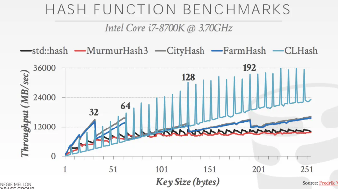
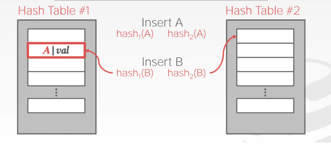
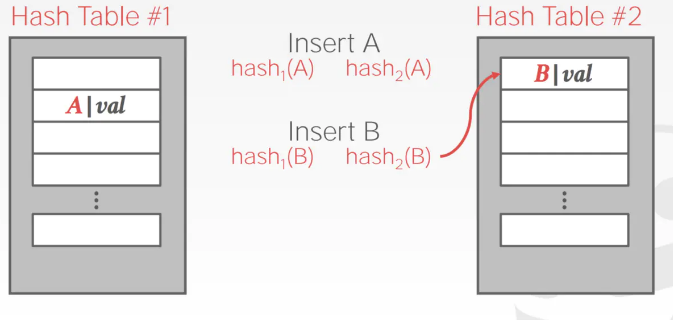
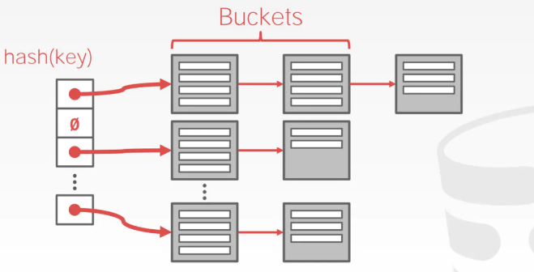

# Hash Data Structure

## DBMS对系统内部的许多不同部分使用各种数据结构：
* 内部元数据：跟踪有关数据库和系统状态的信息。
* 核心数据存储：可用作数据库中元组的基本存储。
* 临时数据结构：DBMS可以在处理查询时动态构建数据结构以加速执行（例如，用于连接的哈希表）。
* 表索引：辅助数据结构，以便更容易找到特定元组。

## 设计决策：
* 数据组织：我们如何布局内存以及在数据结构中存储哪些信息。
* 并发：如何在不引起问题的情况下启用多个线程来访问数据结构。

## 经典hash算法比较

* MurmurHash3
* CityHash
* FarmHash 
* CLHash

    
    
## 静态hash结构

通常采用的冲突解决策略为开放寻址法（Open Addressing），将所有的元素都存放在哈希表内的数组中，**不使用额外的数据结构**

### Open Addressing 开放寻址

开放寻址法的最简单的一种实现就是线性探查（Linear Probing），步骤如下：
* 当插入新的元素时，使用哈希函数在哈希表中定位元素位置；
* 检查哈希表中该位置是否已经存在元素。如果该位置内容为空，则插入并返回，否则转向步骤 3。
* 如果该位置为 i，则检查 i+1 是否为空，如果已被占用，则检查 i+2，依此类推，直到找到一个内容为空的位置。
线性探查（Linear Probing）方式虽然简单，但并不是解决冲突的最好的策略，因为它会导致同类哈希的聚集（Primary Clustering）。这导致搜索哈希表时，冲突依然存在。如果我们要访问 Edward 的信息，因为 Edward 的社保号 111-00-1235 哈希为 1235，然而我们在 1235 位置找到的是 Bob，所以再搜索 1236，找到的却是 Danny，以此类推直到找到 Edward。

### Robin Hood Hash
罗宾汉哈希可以显著降低探查长度的方差, 当插入一个新元素时，对于探查过程中的元素，
如果它的探查长度小于当前插入元素的探查长度，那么交换这两个元素 (以及探测长度)，然后继续探查

### Cuckoo hash
使用具有不同散列函数的多个散列表:
* 在插入时，检查每个表并选择任何有空闲插槽的表。
* 如果没有表有空闲插槽，则从其中一个中删除该元素，然后重新散列它以找到新位置。
查找和删除始终为O（1），因为每个哈希表只检查一个位置。

移动键时，确保我们不会陷入无限循环:
如果我们找到一个循环，那么我们可以用新的散列函数重建整个散列表。
* 使用两个哈希函数，我们（可能）不需要重建表，直到它满50％。
* 使用三个哈希函数，我们（可能）不需要重建表，直到它满约90％。

    
    
    

## 动态hash

### Chained hash

* 为哈希表中的每个槽维护一个桶的链表。
* 通过将具有相同散列键的元素放入同一个存储桶中来解决冲突。
* 如果存储桶已满，请添加另一个存储桶列表。 哈希表可以无限增长，因为您不断添加新桶。
* 要处理并发性，您只需要在每个存储桶上设置一个latch
 
   
   
### Extensible Hash

### Linear Hash