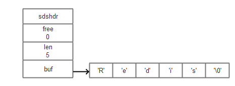
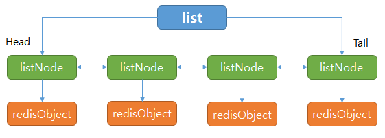
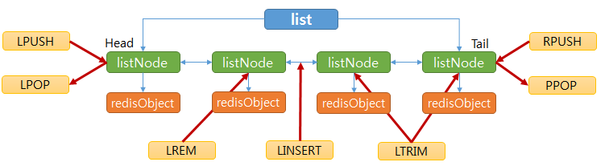
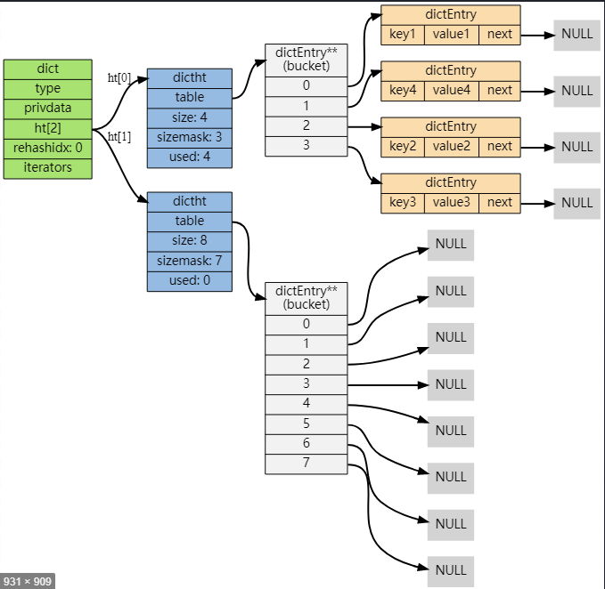
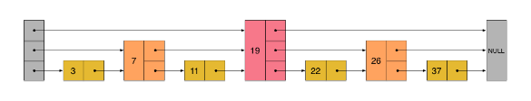
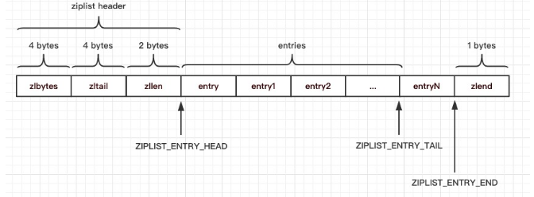

# Redis Basic

## Basic Data Structure

### Simple Dynamic String (SDS)

### Linked List 

### Dict

### Skip List

### Zip List

## Object

### Type 类型

| 类型常量     | 对象名称     |
|--------------|----------|
| REDIS_STRING | 字符串对象   |
| REDIS_LIST   | 列表对象     |
| REDIS_HASH   | 哈希对象     |
| REDIS_SET    | 集合对象     |
| REDIS_ZSET   | 有序集合对象 |

### Encoding 编码

| 编码                      | 数据结构             |
|---------------------------|---------------------|
| REDIS_ENCODING_INT        | long型               |
| REDIS_ENCODING_EMBSTR     | embstr编码动态字符串 |
| REDIS_ENCODING_RAW        | 简单动态字符串       |
| REDIS_ENCODING_HT         | 字典                 |
| REDIS_ENCODING_LINKEDLIST | 链表                 |
| REDIS_ENCODING_ZIPLIST    | 压缩列表             |
| REDIS_ENCODING_INTSET     | 整数集合             |
| REDIS_ENCODING_SKIPLIST   | 跳表                 |

### Object Encoding

* STRING 类型

    | 类型         | 编码                  |
    |--------------|-----------------------|
    | REDIS_STRING | REDIS_ENCODING_INT    |
    | REDIS_STRING | REDIS_ENCODING_EMBSTR |
    | REDIS_STRING | REDIS_ENCODING_RAW    |

* LIST 类型 

    | 类型       | 编码                      |
    |------------|---------------------------|
    | REDIS_LIST | REDIS_ENCODING_ZIPLIST    |
    | REDIS_LIST | REDIS_ENCODING_LINKEDLIST |

* 编码转换（同时满足，使用ZIPLIST）
    * 列表对象保存的所有字符串元素长度小于64byte
    * 列表对象保存的元素个数小于512个

* HASH 类型

    | 类型       | 编码                   |
    |------------|------------------------|
    | REDIS_HASH | REDIS_ENCODING_ZIPLIST |
    | REDIS_HASH | REDIS_ENCODING_HT      |

* 编码转换 （同时满足，使用ZIPLIST）
    * hash对象保存的所有键值对的键&值长度小于64byte
    * hash对象保存的额键的数量小于512个

* SET 类型

    | 类型       | 编码                   |
    |------------|------------------------|
    | REDIS_HASH | REDIS_ENCODING_INTSET |
    | REDIS_HASH | REDIS_ENCODING_HT      |

* 编码转换 同时满足，使用INTSET
    * 所有元素都是整数值
    * 对象保存的元素数量不超过512个

* ZSET 类型

    | 类型       | 编码                    |
    |------------|-------------------------|
    | REDIS_HASH | REDIS_ENCODING_ZIPLIST  |
    | REDIS_HASH | REDIS_ENCODING_SKIPLIST |

* 编码转换（同时满足，使用ZIPLIST）
    * 集合保存的元素数量小于128个
    * 集合保存的所有元素成员长度小于64byte
